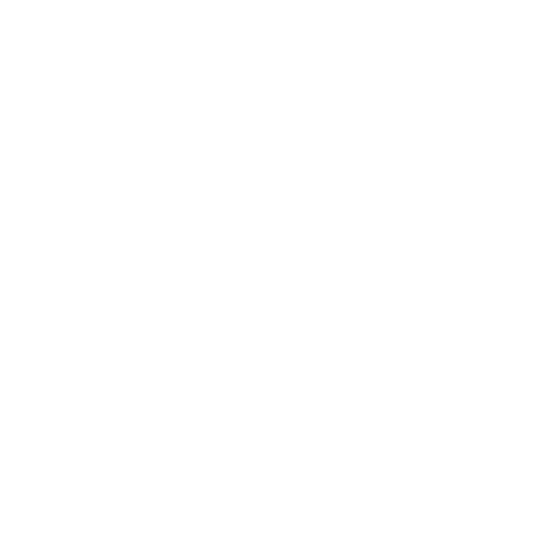
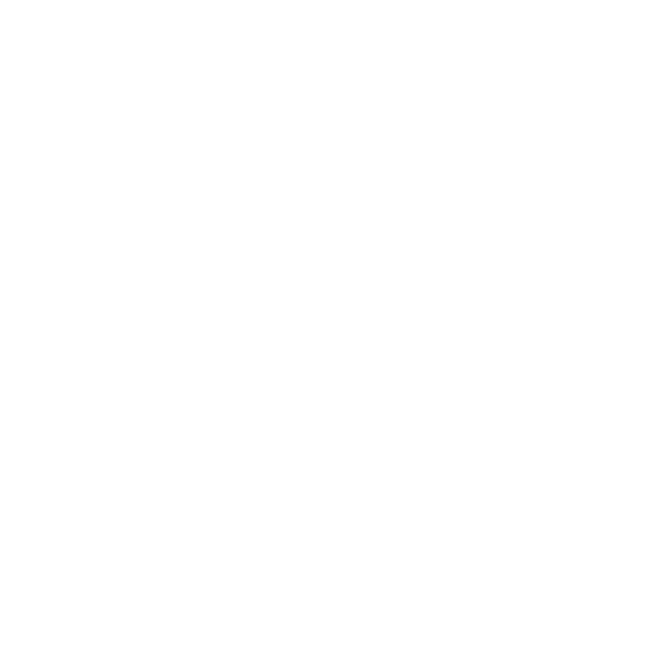
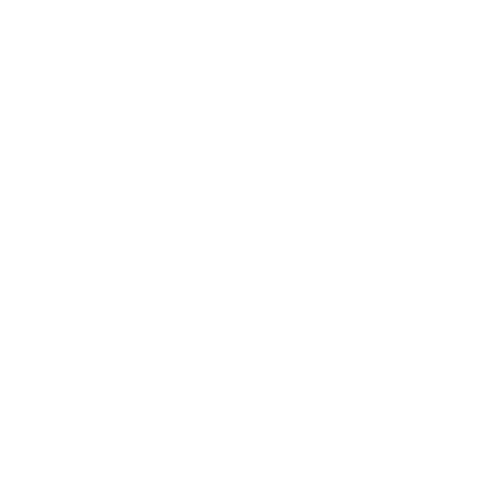

---

<br />


<br />

<h3 align="center">
Hi there </a>
</h3>

<h2 align="center">
  CODE, CI/CD, AND RELIABILITY. THE GOLDEN TRIANGLE OF MY DAILY LIFE
</h2>

## About Me

```Python

class MyProfile:
    def __init__(self, name: str, passions: list[str], approches: list[str]):
        self.name = name
        self.passions = passions
        self.approaches = approches

    def get_presentation(self) -> str:
        """Returns a full presentation as a string."""
        presentation = (
            f"Hi, my name is {self.name}.\n\n"
            f"My passions include: {', '.join(self.passions)}.\n"
            f"My approach: {', '.join(self.approaches)}."
        )
        return presentation

profile = MyProfile(
    name="Elysee KOUA",
    passions=["programming", "homelabbing"],
    approaches=["discovering new solutions", "testing and implementing them", "building reliable systems"]
)

print(profile.get_presentation())

```

<br/>
<br/>

<table>
  <tr>
      <td align="left" colspan="5" width="100">
        <!-- LANGAGES -->
      </td>
  </tr>
  <tr>
    <td align="center" width="100">
      
      <br>
      PYTHON
    </td>
    <td align="center" width="100">
      
      <br>
      JAVASCRIPT
    </td>
    <td align="center" width="100">
      
      <br>
      BASH
    </td>
    <td align="center" width="100">
      
      <br>
      HTML
    </td>
    <td align="center" width="100">
      
      <br>
      CSS
    </td>
    <td align="center" width="100">
      
      <br>
      MARKDOWN
    </td>
    <td align="center" width="100">
      
      <br>
      SCSS
    </td>
    <td align="center" width="100">
    </td>
  </tr>

  <tr>
      <td align="left" colspan="5" width="100">
        <br/>
        <!-- FRAMEWORKS & LIBRARIES -->
      </td>
  </tr>
  <tr>
    <td align="center" width="100">
      
      <br>
      DJANGO
    </td>
    <td align="center" width="100">
      
      <br>
      ODOO
    </td>
    <td align="center" width="100">
      
      <br>
      FLASK
    </td>
    <td align="center" width="100">
      
      <br>
      FASTAPI
    </td>
    <td align="center" width="100">
      
      <br>
      VUEJS
    </td>
    <td align="center" width="100">
      
      <br>
      GRAPHQL
    </td>
    <td align="center" width="100">
      
      <br>
      REST API
    </td>
    <td align="center" width="100">
      
      <br>
      PYTEST
    </td>
  </tr>
  <tr>
    <td align="center" width="100">
      
      <br>
      SELENIUM
    </td>
    <td align="center" width="100">
    </td>
    <td align="center" width="100">
    </td>
    <td align="center" width="100">
    </td>
    <td align="center" width="100">
    </td>
    <td align="center" width="100">
    </td>
    <td align="center" width="100">
    </td>
    <td align="center" width="100">
    </td>
  </tr>

  <tr>
      <td align="left" colspan="5" width="100">
        <br/>
        <!-- OUTILS IA / DATA -->
      </td>
  </tr>
  <tr>
    <td align="center" width="100">
      
      <br>
      HUGGING FACE
    </td>
    <td align="center" width="100">
      
      <br>
      OLLAMA
    </td>
    <td align="center" width="100">
      
      <br>
      OPEN WEBUI
    </td>
    <td align="center" width="100">
      
      <br>
      N8N
    </td>
    <td align="center" width="100">
      
      <br>
      KAFKA
    </td>
    <td align="center" width="100">
    </td>
    <td align="center" width="100">
    </td>
    <td align="center" width="100">
    </td>
  </tr>

  <tr>
      <td align="left" colspan="5" width="100">
        <br/>
        <!-- DEVOPS & INFRASTRUCTURE AS CODE -->
      </td>
  </tr>
  <tr>
    <td align="center" width="100">
      
      <br>
      ANSIBLE
    </td>
    <td align="center" width="100">
      
      <br>
      TERRAFORM
    </td>
    <td align="center" width="100">
      
      <br>
      DOCKER
    </td>
    <td align="center" width="100">
      
      <br>
      KUBERNETES
    </td>
    <td align="center" width="100">
    </td>
    <td align="center" width="100">
    </td>
    <td align="center" width="100">
    </td>
    <td align="center" width="100">
    </td>
  </tr>

  <tr>
      <td align="left" colspan="5" width="100">
        <br/>
        <!-- SYSTÈMES & VIRTUALISATION -->
      </td>
  </tr>
  <tr>
    <td align="center" width="100">
      
      <br>
      UBUNTU
    </td>
    <td align="center" width="100">
      
      <br>
      WINDOWS
    </td>
    <td align="center" width="100">
      
      <br>
      MACOS
    </td>
    <td align="center" width="100">
      
      <br>
      PROXMOX
    </td>
    <td align="center" width="100">
      
      <br>
      FEDORA
    </td>
    <td align="center" width="100">
    </td>
    <td align="center" width="100">
    </td>
    <td align="center" width="100">
    </td>
  </tr>

  <tr>
      <td align="left" colspan="5" width="100">
        <br/>
        <!-- CLOUD & HÉBERGEMENT -->
      </td>
  </tr>
  <tr>
    <td align="center" width="100">
      
      <br>
      AWS
    </td>
    <td align="center" width="100">
      
      <br>
      OVH
    </td>
    <td align="center" width="100">
      
      <br>
      DIGITALOCEAN
    </td>
    <td align="center" width="100">
      
      <br>
      CLOUDFLARE
    </td>
    <td align="center" width="100">
    </td>
    <td align="center" width="100">
    </td>
    <td align="center" width="100">
    </td>
    <td align="center" width="100">
    </td>
  </tr>

  <tr>
      <td align="left" colspan="5" width="100">
        <br/>
        <!-- BASES DE DONNÉES & CACHE -->
      </td>
  </tr>
  <tr>
    <td align="center" width="100">
      
      <br>
      POSTGRESQL
    </td>
    <td align="center" width="100">
      
      <br>
      MYSQL
    </td>
    <td align="center" width="100">
      
      <br>
      SQLITE
    </td>
    <td align="center" width="100">
      
      <br>
      REDIS
    </td>
    <td align="center" width="100">
    </td>
    <td align="center" width="100">
    </td>
    <td align="center" width="100">
    </td>
    <td align="center" width="100">
    </td>
  </tr>

  <tr>
      <td align="left" colspan="5" width="100">
        <br/>
        <!-- OBSERVABILITÉ & MONITORING -->
      </td>
  </tr>
  <tr>
    <td align="center" width="100">
      
      <br>
      ELASTICSEARCH
    </td>
    <td align="center" width="100">
      
      <br>
      KIBANA
    </td>
    <td align="center" width="100">
      
      <br>
      BEATS
    </td>
    <td align="center" width="100">
      
      <br>
      AGENTS
    </td>
    <td align="center" width="100">
      
      <br>
      GRAFANA
    </td>
    <td align="center" width="100">
      
      <br>
      LOKI
    </td>
    <td align="center" width="100">
      
      <br>
      MIMIR
    </td>
    <td align="center" width="100">
      
      <br>
      TEMPO
    </td>
  </tr>

  <tr>
      <td align="left" colspan="5" width="100">
        <br/>
        <!-- COLLABORATION & COMMUNAUTÉS -->
      </td>
  </tr>
  <tr>
    <td align="center" width="100">
      
      <br>
      GIT
    </td>
    <td align="center" width="100">
      
      <br>
      GITHUB
    </td>
    <td align="center" width="100">
      
      <br>
      GITLAB
    </td>
    <td align="center" width="100">
      
      <br>
      STACKOVERFLOW
    </td>
    <td align="center" width="100">
      
      <br>
      DISCORD
    </td>
    <td align="center" width="100">
      
      <br>
      REDDIT
    </td>
    <td align="center" width="100">
    </td>
    <td align="center" width="100">
    </td>
  </tr>

  <tr>
      <td align="left" colspan="5" width="100">
        <br/>
        <!-- DÉVELOPPEMENT & PRODUCTIVITÉ -->
      </td>
  </tr>
  <tr>
    <td align="center" width="100">
      
      <br>
      VS CODE
    </td>
    <td align="center" width="100">
      
      <br>
      PYCHARM
    </td>
    <td align="center" width="100">
      
      <br>
      POSTMAN
    </td>
    <td align="center" width="100">
      
      <br>
      CANVA
    </td>
    <td align="center" width="100">
      
      <br>
      OBSIDIAN
    </td>
    <td align="center" width="100">
    </td>
    <td align="center" width="100">
    </td>
    <td align="center" width="100">
    </td>
  </tr>
</table>

<br/>

---

<details align="center">
    <summary><h2>⚡ MY GITHUB STATS</h2></summary>
    <figure>
        
        <br/>
        
        <br/>
        
    </figure>
</details>

<br/>

---

<br/>

<div align="center">
  <a style="text-decoration: none" href="https://www.linkedin.com/in/elyseekoua/" title="My LinkedIn Profile">
    
  </a>
  <a style="text-decoration: none" href="https://www.codingame.com/profile/22eb2c9be8f4df30ce3e730439abedde1074114" title="My Codingame Profile">
    
  </a>
</div>

<br/>

---
